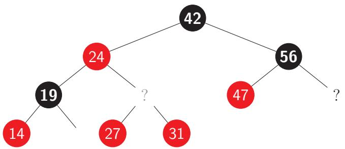
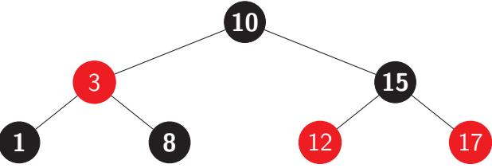

# Algoritmer og Datastrukturer (NDAA04010U) Ugeopgave 3

Københavns Universitet

2025

# 1 Parallelle algoritmer

I denne opgave er vi interesseret i at tælle trekanter i en simpel, uorienteret graf G = (V, E), dvs. tripler af knuder u, v, w ∈ V hvor alle par af knuder er kanter, dvs. {u, v} ⊆ E, {u, w} ⊆ E, {u, w} ⊆ E. Lad v1, . . . , vn være en nummerering af de n knuder i V . Incidensmatricen M(E) er en symmetrisk n-gange-n matrix hvor M(E)ij = 1 hvis {vi , vj} ∈ E og M(E)ij = 0 hvis {vi , vj} ̸∈ E. Antag at n er en potens af 2.

a) Argument´er for at matricen P = M(E) 2 har egenskaben at Pij er lig med antal stier af længde præcis 2 der forbinder vi og vj .

b) Brug resultatet fra a) til at designe en parallel algoritme der tæller antal trekanter i en graf. Du kan antage at input til algoritmen er en incidensmatrix M(E).

c) Hvad er span og arbejde for din algoritme fra b) hvis du gør brug af en algoritme til matrixmultiplikation der har arbejde T1 og span T∞? Giv svar som funktion af n, T1, T∞.

# 2 Amortiseret analyse

I denne opgave betragter vi potentialfunktionen der bruges til at analysere dynamiske tabeller i CLRS sektion 16.4.1. Lad Φi betegne potentialfunktionens værdi efter i Table-Insert operationer, uden nogen Table-Delete operationer. Hvilke egenskaber har Φi? Vælg ´et eller flere korrekte svar og beskriv hvordan du kom frem til dem (b˚ade positive og negative svar).

- 1. Φi = Ω(1).
- 2. Φi = O(1).
- 3. Φi = Ω(i).
- 4. Φi = O(i).
- 5. Φi ≥ Φi−1.
- 6. Φi ≥ 0.

# 3 Rød-sorte søgetræer

Betragt et rød-sort binært søgetræ T (eng. red-black binary search tree), som beskrevet i CLRS kapitel 13. Betragt nedenst˚aende træ, hvor alle blade er udeladt (som p˚a CLRS figur 13.1.c) og to indre knuder er uspecificerede:

Hvilke knuder er mulige p˚a mindst ´en af positionerne markeret med ?, hvis træet skal overholde invarianterne for et rød-sort binært søgetræ? Vælg ´et eller flere korrekte svar og beskriv hvordan du kom frem til dem (b˚ade positive og negative svar).

- 1. En rød knude med nøglen 28.
- 2. En rød knude med nøglen 44.
- 3. En rød knude med nøglen 58.
- 4. En sort knude med nøglen 25.
- 5. En sort knude med nøglen 30.
- 6. En sort knude med nøglen 66.

# 4 Indsættelse i rød-sorte søgetræer

Betragt dette rød-sorte binære søgetræ (eng. red-black binary search tree), hvor bladene er udeladt p˚a tegningen:

Antag at vi bruger indsættelsesalgoritmen RB-Insert fra CLRS kapitel 13 til at indsætte nøglen 9. Hvad sker med træet? Vælg præcis ´et svar og beskriv hvordan du kom frem til det.

- 1. 9 indsættes som højre barn til knude 8 og farves rød.
- 2. 9 indsættes som højre barn til knude 8 og farves sort.
- 3. 9 indsættes som venstre barn til knude 12 og farves rød.
- 4. 9 indsættes som venstre barn til knude 12 og farves sort.
- 5. Ingen af ovenst˚aende.

# 5 Køretid for rød-sorte søgetræer

Betragt et rød-sort binært søgetræ T (eng. red-black binary search tree), som beskrevet i CLRS kapitel 13, hvorp˚a der (startende med et tomt træ) udføres n1 Insert operationer, n2 Delete operationer, og n3 Search operationer (sidstnævnte kaldes ogs˚a "access" operationer). Det totale antal operationer er N = n1 + n2 + n3. Hvilke af følgende udsagn er altid sande? Vælg ´et eller flere korrekte svar og beskriv hvordan du kom frem til dem (b˚ade positive og negative svar).

- 1. Den samlede tid for operationerne er Ω(N).
- 2. Den samlede tid for operationerne er O(N lg N).
- 3. Den samlede tid for operationerne er O(n3 + (n1 + n2) lg N).
- 4. Dybden af T er højst 2 lg(n1 + 1).
- 5. Alle blade i T er i dybde mindst ⌊lg(n3 + 1)⌋.
- 6. Alle sorte knuder i T har en afstand til roden, der er et lige tal.