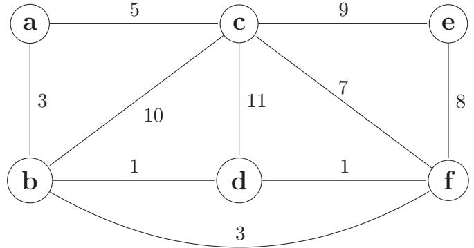
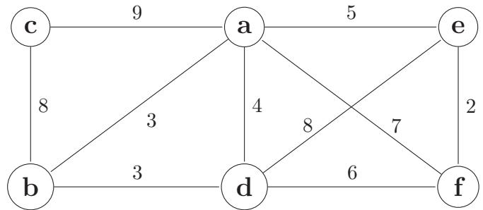
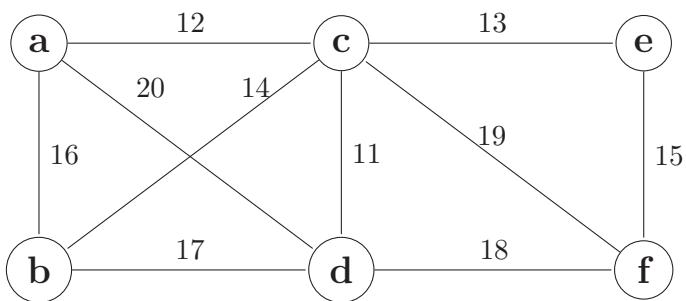
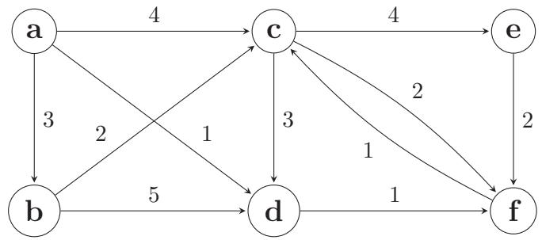
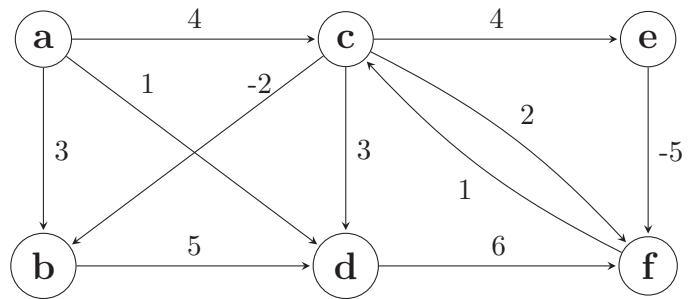

# Algoritmer og Datastrukturer (NDAA04010U) Ugeopgave 5

Københavns Universitet

2025

## 1 Mindste udspændende træ

Betragt mindste udspændende træ (eng. minimum spanning tree) problemet p˚a denne graf:

Hvilke kanter er med i mindste udspændende træ? Angiv for hver kant i træet en snitmængde S hvor kanten er let (eng. light edge) i snittet (S, V − S).

- 1. {a,b}
- 2. {a,c}
- 3. {b,c}
- 4. {b,d}
- 5. {b,f}
- 6. {c,d}
- 7. {c,e}
- 8. {c,f}
- 9. {d,f}
- 10. {e,f}

## 2 Prim's algoritme

Betragt følgende vægtede, uorienterede graf:

Hvis Prim's algoritme køres p˚a denne graf med start i knude a, i hvilken rækkefølge bliver knuderne inkluderet i det mindste udspændende træ? (Med andre ord, i hvilken rækkefølge bliver de taget ud af prioritetskøen?)

- 1. a, b, d, e, f, c
- 2. a, b, e, d, f, c
- 3. a, b, d, c, f, e
- 4. a, b, e, f, d, c

#### 3 Snit og sikre kanter

Betragt følgende uorienterede, vægtede graf med knudemængde V = {a, b, c, d, e, f}:

Betragt kantmængden A = {{a, c}, {c, d}}, som er en delmængde af et minimalt udspændende træ (eng. minimum spanning tree). Vi er interesserede i snit (eng. cuts), sikre kanter (eng. safe edges) for A, og snit der respekterer (eng. respects) en kantmængde A. Hvilke af følgende udsagn er sande? Vælg ´et eller flere korrekte svar og beskriv hvordan du kom frem til dem (b˚ade positive og negative svar).

- 1. Lad S1 = {a, b, c, d}. Snittet (S1, V − S1) respekterer kantmængden A.
- 2. Lad S2 = {a, c, e}. Snittet (S2, V − S2) respekterer kantmængden A.
- 3. Lad S3 = {b, e, f}. Snittet (S3, V − S3) respekterer kantmængden A.
- 4. {d, f} er en sikker kant for A.
- 5. {c, e} er en sikker kant for A.
- 6. {a, d} er en sikker kant for A.

#### 4 Korteste veje

Betragt korteste veje problemet (eng. single-source shortest-paths problem) med startknude a p˚a følgende graf:

Hvilke kanter er med i korteste-vej træet? Hvilken algoritme er velegnet til at beregne korteste-vej træet?

- 1. (a,b)
- 2. (a,c)
- 3. (a,d)
- 4. (b,c)
- 5. (b,d)
- 6. (c,d)
- 7. (c,e)
- 8. (c,f)
- 9. (d,f)
- 10. (e,f)
- 11. (f,c)

#### 5 Korteste veje

Betragt korteste veje problemet (eng. single-source shortest-paths problem) med startknude a p˚a følgende graf:

Hvilke kanter er med i korteste-vej træet? Hvilken algoritme er velegnet til at beregne korteste-vej træet?

- 1. (a,b)
- 2. (a,c)
- 3. (a,d)
- 4. (b,d)
- 5. (c,b)
- 6. (c,d)
- 7. (c,e)
- 8. (c,f)
- 9. (d,f)
- 10. (e,f)
- 11. (f,c)

#### 6 Korteste-veje træ

Betragt et korteste veje problem p˚a en orienteret graf G = (V, E) (eng. single-source shortest-paths problem on a directed graph) med vægtfunktion w : E → R og startknude s. Hvilke af følgende egenskaber har et korteste-veje træ (eng. shortest-paths tree) G′ = (V ′ , E′ ) altid? Vælg ´et eller flere korrekte svar og beskriv hvordan du kom frem til dem (b˚ade positive og negative svar).

- 1. I G′ kan alle knuder i V n˚as fra s.
- 2. Knuden s har kun udg˚aende kanter i G′ .
- 3. G′ har |V ′ | − 1 kanter.
- 4. Hvis alle vægte er unikke indeholder G′ af de |E ′ | kanter i G, der har lavest vægt.
- 5. G′ indeholder den kant i G, der har lavest vægt.
- 6. Enhver sti i G′ er en korteste vej i G.
- 7. Alle korteste veje i G svarer til en sti i G′ .
- 8. G′ er et binært træ med s som rod.
- 9. G′ er et mindste udspændende træ (eng. minimum spanning tree).
- 10. Kan beregnes med Dijkstra's algoritme.

#### 7 Valg af datastruktur

Antag at vi gerne vil skabe en datastruktur Ventetid, der indeholder en mængde af n afgangstidspunkter (ugedag og klokkeslet, fx for en bus). For enkelheds skyld skal der blot holdes styr p˚a ´en rute og ´et stoppested, s˚a den eneste information er afgangstidspunkter. Datastrukturen skal understøtte to operationer: Insert(x), der indsætter et nyt afgangstidspunkt, og HvorLænge(x) der returnerer antal minutter fra tidspunkt x til den næste afgang.

Hvad er det mest passende valg af datastruktur til løsning af dette problem blandt nedenst˚aende, og hvilken worst-case (amortiseret) køretid for HvorLænge(x) bliver resultatet af dette valg? Udtryk svaret som funktion af n. Vælg præcis ´et svar og beskriv hvordan du kom frem til det.

- 1. Fibonacci hob (eng. Fibonacci heap), tid O(lg n).
- 2. Fibonacci hob (eng. Fibonacci heap), tid O(1).
- 3. Rød-sort binært søgetræ (eng. red-black binary search tree), tid O(1).
- 4. Rød-sort binært søgetræ (eng. red-black binary search tree), tid O(lg n).
- 5. En dynamisk tabel, tid O(1).
- 6. En dynamisk tabel, tid O(lg n).